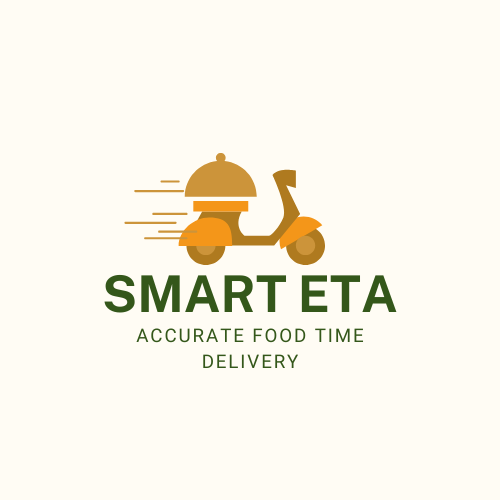

# 🍛 SMART ETA: Machine Learning Solution for Accurate Food Delivery Time Prediction  
 
 
 
 
 

 
 

 

--- 
## 📁 Repository Outline  
- .vscode 
- deployment 
- FinalProject.ipynb 
- FinalProject_inference.ipynb 
- Food_Delivery_Times.csv 
- README.md 
- ariflow_ml_pipeline.py 
- requirments.txt 
--- 

## 🎯 Problem Background 
Waktu pengantaran (Estimated Time of Arrival / ETA) merupakan faktor penting dalam layanan pengantaran makanan. Ketepatan prediksi ETA sangat memengaruhi **kepuasan pelanggan**, **efisiensi operasional**, dan **keputusan logistik**.  
Namun, kondisi dunia nyata seperti **cuaca**, **lalu lintas**, **jarak**, dan **pengalaman kurir** sering menyebabkan waktu pengantaran aktual berbeda dari perkiraan. 

Proyek **Smart ETA** ini bertujuan untuk membangun model **Machine Learning Regression** yang mampu **memprediksi waktu pengantaran makanan secara akurat** berdasarkan berbagai kondisi operasional.  

Solusi ini dapat membantu perusahaan logistik atau food delivery seperti *Gojek*, *GrabFood*, atau *ShopeeFood* untuk: 
- Meningkatkan akurasi estimasi pengantaran. 
- Mengoptimalkan rute dan jadwal kurir. 
- Meningkatkan pengalaman pelanggan melalui ETA yang lebih andal. 
--- 

💡 **Smart ETA** hadir sebagai solusi berbasis **machine learning** untuk membantu perusahaan pengantaran makanan:  
- ⏱️ Memperkirakan waktu pengiriman dengan lebih akurat  
- 🚴‍♂️ Mengoptimalkan rute dan alokasi kurir  
- 😀 Meningkatkan kepuasan pelanggan dengan informasi ETA yang realistis  
 
--- 

## 🎯 Project Output  
- ✅ **Model terbaik:** `Gradient Boosting Regressor` dengan performa terbaik (R² > 0.80)  
- 🌐 **Aplikasi web interaktif** berbasis Streamlit untuk prediksi waktu pengantaran  
- 💾 **Model tersimpan (.pkl)** siap diintegrasikan ke sistem operasional  

---  

## 📊 Data Overview  
**Deskripsi singkat:**  
**Dataset:** `Food_Delivery_Times.csv`  
Deskripsi singkat:  

- Jumlah data: **1.000 baris**  
- Jumlah kolom: **9 fitur**  
- **Fitur numerik:** Distance_km, Preparation_Time_min, Courier_Experience_yrs  
- **Fitur kategorikal:** Weather, Traffic_Level, Time_of_Day, Vehicle_Type  
- **Target:** Delivery_Time_min (waktu pengantaran aktual dalam menit) 

| No | Kolom | Non-Null | Dtype | Deskripsi | 
|----|--------|-----------|--------|------------| 
| 1 | `Order_ID` | 1000 | int64 | ID unik untuk setiap pesanan | 
| 2 | `Distance_km` | 1000 | float64 | Jarak antara restoran dan pelanggan (km) | 
| 3 | `Weather` | 970 | object | Kondisi cuaca saat pengantaran | 
| 4 | `Traffic_Level` | 970 | object | Tingkat kepadatan lalu lintas | 
| 5 | `Time_of_Day` | 970 | object | Waktu pengantaran (pagi, siang, sore, malam) | 
| 6 | `Vehicle_Type` | 1000 | object | Jenis kendaraan yang digunakan kurir | 
| 7 | `Preparation_Time_min` | 1000 | int64 | Waktu persiapan makanan (menit) | 
| 8 | `Courier_Experience_yrs` | 970 | float64 | Lama pengalaman kurir (tahun) | 
| 9 | `Delivery_Time_min` | 1000 | int64 | Target waktu pengantaran (menit) - *Target Variable* | 

🧹 Beberapa kolom seperti **Weather**, **Traffic_Level**, dan **Time_of_Day** memiliki missing values dan telah ditangani melalui preprocessing.  

**Langkah preprocessing:**  
- Handling missing values  
- Encoding data kategorikal  
- Feature scaling (StandardScaler)  
- Outlier detection & data cleaning  

--- 

## ⚙️ Methodology 
Proyek ini menggunakan pendekatan **Supervised Learning (Regresi)**.  

Langkah-langkah utama: 

1. **Data Cleaning & Exploration**  
- Menangani missing values dan outlier  
- Eksplorasi data visual (EDA) untuk memahami korelasi antar fitur  

2. **Feature Engineering**  
- Normalisasi dan encoding menggunakan `ColumnTransformer`  
- Pipeline preprocessing untuk numerik dan kategorikal  
 
3. **Model Definition & Training**  
Model yang diuji:  
- Linear Regression *(Baseline)*  
- K-Nearest Neighbors (KNN)  
- Support Vector Machine (SVR)  
- Decision Tree Regressor  
- Random Forest Regressor  
- Gradient Boosting Regressor  

4. **Cross Validation**  
- 5-Fold CV digunakan untuk mengevaluasi performa model secara konsisten.  

5. **Hyperparameter Tuning**  
- Dilakukan menggunakan `GridSearchCV` pada model Gradient Boosting.  

6. **Model Evaluation Metrics**  
- Mean Absolute Error (MAE)  
- Root Mean Squared Error (RMSE)  
- R² (Coefficient of Determination)  

--- 

## 🧠 Model Selection 
Berdasarkan hasil evaluasi dengan Cross Validation: 
- **Model terbaik:** `Gradient Boosting Regressor`  
- **R² Score (CV):** ±0.71  
- **MAE:** ±7.39 menit  
- **Kesimpulan:** Model ini memberikan keseimbangan antara akurasi dan generalisasi, unggul dibandingkan model lain seperti Random Forest dan SVM. 
 
Setelah dilakukan **Hyperparameter Tuning**, model menunjukkan performa stabil meskipun peningkatannya kecil — menandakan bahwa parameter default sudah cukup optimal untuk dataset ini. 
 
--- 

## 💡 Business Insight 
Dari hasil analisis dan pemodelan, diperoleh beberapa insight utama: 
- **Distance_km** memiliki pengaruh paling besar terhadap waktu pengantaran.  
- **Preparation_Time_min** dan **Courier_Experience_yrs** juga signifikan terhadap akurasi prediksi.  
- Kondisi **cuaca dan lalu lintas** (seperti *Rainy* atau *High Traffic*) meningkatkan waktu pengantaran secara konsisten.  

Dengan insight ini, perusahaan dapat: 
- Memberikan estimasi waktu pengantaran yang realistis berdasarkan kondisi real-time.  
- Menentukan insentif kurir berdasarkan kompleksitas pengantaran.  
- Mengoptimalkan jadwal pengantaran dan alokasi wilayah. 

--- 

## 🧩 Tech Stack 
**Bahasa Pemrograman & Tools** 
- Python 3.9  
- Jupyter Notebook  
- Hugging Face (untuk deployment interaktif) (https://huggingface.co/spaces/bputradana/deploygroup1)

**Library Utama** 
- `pandas`, `numpy`, `matplotlib`, `seaborn`  
- `scikit-learn` (preprocessing, modeling, evaluation)  
- `pickle` (menyimpan model terlatih)  

--- 

## 🎨 Future Improvement 
Beberapa pengembangan potensial: 
- Integrasi data **real-time API** untuk cuaca dan lalu lintas.  
- Implementasi **XGBoost** atau **LightGBM** untuk perbandingan performa.  
- Deployment aplikasi **Smart ETA Dashboard** di Streamlit Cloud.  
- Penambahan fitur seperti estimasi waktu kurir hingga pelanggan (end-to-end tracking).  

---  

## 📚 Reference 
- Dataset: Simulasi internal food delivery dataset  
- Dokumentasi scikit-learn: https://scikit-learn.org/stable/  
- Inspirasi proyek: Real-world ETA prediction models (Grab, Uber Eats, DoorDash research) 

--- 

 
 

 

> ✨ “Smart ETA transforms raw delivery data into actionable intelligence —  
> helping businesses deliver faster, smarter, and more reliably.”🕒  
> *Developed by Kelompok 1 Batch 032 with passion for data and innovation.* 

--- 
